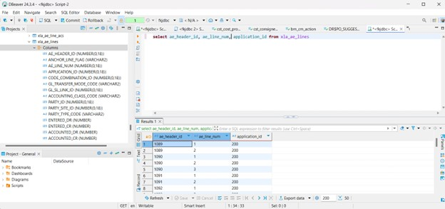
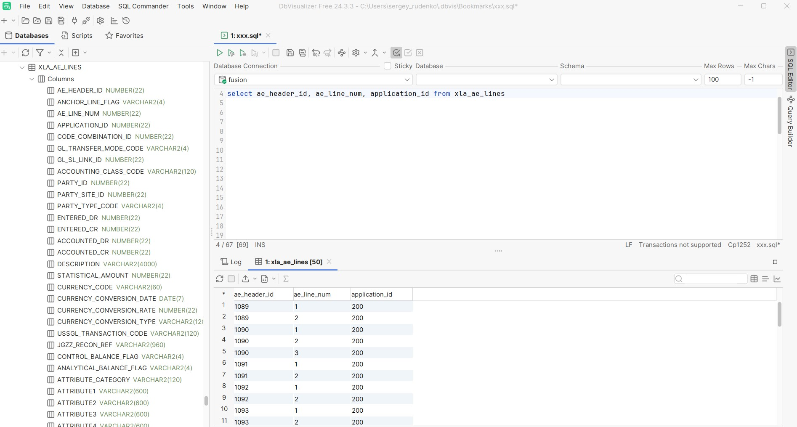

# Oracle Fusion JDBC Driver

A read‑only JDBC driver that lets you run SQL queries against Oracle Fusion.
This minimal viable implementation works seamlessly in mature IDE's - DBeaver, DbVisualizer and IntelliJ. 
And it isn’t just for Java - it can be used from any JVM‑hosted language to build custom data pipelines.

---

## 📄 Table of Contents

- [🚀 Features](#-features)
- [🛠 Prerequisites](#-prerequisites)
- [📝 Installation](#-installation)
- [⚙️ Configuration](#-configuration)
- [❗ Limitations](#-Limitations)
- [⚠️ Important Disclaimer](#-important-disclaimer)
- [📝 TODO](#-todo)
- [📫 Contact](#-contact)

---

## 🚀 Features
- **Your Credentials, Your Control:** Unlike many closed‑source solutions, this driver keeps your credentials under your control, ensuring peace of mind and security.
- **Incremental Introspection**: Enjoy real‑time code completions as you type! The driver leverages a local metadata cache that incrementally introspects and stores schema information, dramatically speeding up completion suggestions in DBeaver. (maybe slow only at 1-st run, wait a minute)
- **Minimalist Design:** A read‑only, no‑frills JDBC driver for Oracle Fusion exploring/reporting via WSDL.
- **IDE Integration:** Run SQL queries directly from your favorite IDE - DBeaver, DbVisualizer, IntelliJ, etc. without the extra overhead.
_**DBeaver**_

_**DBVisualizer**_ 

- **JVM-Hosted Flexibility:** Use this driver not only from Java but from any JVM‑hosted language for building custom data pipelines.
- **Easy to Configure:** Simple setup by providing your connection URL and credentials.

---

## 🛠 Prerequisites

Before using this driver, ensure you have the following:

- **Oracle Fusion Access:** Valid credentials with access to Oracle Fusion reporting (via WSDL).
- **JDK/JRE:** A Java 8 (or later) runtime installed on your machine.
- **Your IDE of Choice:** DBeaver, DbVisualizer, IntelliJ IDEA (or any other mature development environment I don't know and tested yet :)) .

---

## 📝 Installation

1. **Download the Driver:**

   Download the latest version of the driver from the releases of this repository (upper right corner of this page) linked below:

   [release driver](https://github.com/krokozyab/ofjdbc/releases/tag/initial)

2. **Alternatively, clone the repository and build the driver from source.**

3. **Create report in OTBI**

   In you fusion instance un-archive _DM_ARB.xdm.catalog_ and _RP_ARB.xdo.catalog_ from **otbireport** catalog of this repository
into _/Shared Foldrs/Custom/Financials_ folder (that can be different if you will, see logic in source code). 

## ⚙️ Configuration
1. **Place the Driver File: Place the driver JAR file into your designated folder.**
2. **Register the Driver in Your IDE: In your IDE (DBeaver, DBVisualizer, IntelliJ), register a new driver pointing to the driver JAR file.**
3. **Set the Driver Class: Choose my.jdbc.wsdl_driver.WsdlDriver as the driver class name.**
4. **Create a New Database Connection: In your IDE, create a new database connection using the driver you just registered.**
5. **Enter the Connection String (JDBC URL): jdbc:wsdl://you-server.oraclecloud.com/xmlpserver/services/ExternalReportWSSService?WSDL:/Custom/Financials/RP_ARB.xdo**
6. **Enter Your Credentials: Provide the username and password for basic authentication.**

## ❗ Limitations

While this driver offers a lightweight and open‑source alternative to closed‑source solutions, it is important to note that:

It is a minimal implementation designed as a proxy for executing SQL via WSDL, so it may not support all advanced JDBC features.
Some limitations are inherent to the underlying Oracle Fusion reporting architecture.
For further insights on some of these challenges, see this article on using synchronous BIP for data extraction.
https://www.ateam-oracle.com/post/using-synchronous-bip-for-extracting-data-dont

## ⚠️ Important Disclaimer
Before using this driver in your organization, please ensure that you consult with your company’s security team or other responsible personnel. It is important to verify that the driver complies with your organization’s security policies and standards. By using this driver, you acknowledge that you have reviewed and obtained the necessary approvals regarding the security implications of its deployment.

## 📝 TODO

This project is a minimal viable implementation, and there are several areas for future enhancement:

- **Additional JDBC Features:**
   - Support for advanced JDBC methods (scrollable ResultSets, etc.).

- **Error Handling:**
   - Improve the integration with IDE-specific features (e.g., better error messages).

- **Performance & Scalability:**
   ~~- Optimize query pagination and fetch size management.~~
   ~~- Currently, if you enter 'select * from xyz', the driver automatically converts it to 'select * from xyz FETCH FIRST 50 ROWS ONLY'. However, if you enter a query that already includes pagination (e.g., 'select * from xyz FETCH FIRST 1000 ROWS ONLY'), it remains unchanged. Pagination is currently your responsibility.~~
   - Done

- **Extended Metadata:**
   - Implement additional DatabaseMetaData methods to provide richer metadata support.

- **Customizability:**
   - Explore supporting additional authentication mechanisms beyond Basic Auth.

Check back on the GitHub repository for updates and improvements as the project evolves.

## 📫 Contact
If you have questions, feel free to reach out via GitHub Issues or [email@sergey.rudenko.ba@gmail.com].

