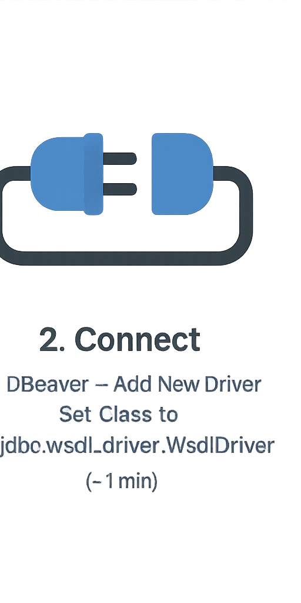

# JDBC Driver & SQL Query Tool for Oracle Fusion

[](LICENSE.md)   [](https://github.com/krokozyab/ofjdbc/releases)   [](https://ko-fi.com/sergeyrudenko)

**Run SQL queries against Oracle Fusion – right from DBeaver.**  
This lightweight, read-only JDBC driver lets you explore and report on your Oracle Fusion data using familiar SQL tools – without giving up control of your credentials or paying for a black-box solution.

---

## 💡 Why DBeaver + ofjdbc?

| 🚀 **Feature** | 🎯 **Benefit** |
|----------------|----------------|
| 📚 **Full Metadata Support** | Smart auto-complete, ER diagrams, and rich SQL highlighting |
| ⚡ **Local Metadata Cache** | Lightning-fast schema browsing after the first run |
| 🔒 **Secure & Open-Source** | Keep full control of your Oracle Fusion credentials |
| 🖱 **One-Click Setup in DBeaver** | Just add the JAR, connect, and query |
| 🛡 **Read-Only by Design** | Safe for reporting without risking production data |

> **In short:** You get the power of DBeaver + the data from Oracle Fusion, without the hassle or hidden black boxes.

---

## ⚡ Quick Start in 3 Steps

<div align="center">

|  |  |  |
|---|---|---|
| **1. Download**<br/>Grab the JAR from [**Releases**](https://github.com/krokozyab/ofjdbc/releases)<br/>*(~10 sec)* | **2. Connect**<br/>In DBeaver → Add New Driver<br/>Set Class to `my.jdbc.wsdl_driver.WsdlDriver`<br/>*(~1 min)* | **3. Query**<br/>Browse tables, run SQL, enjoy instant auto-complete |

</div>

---

## 📄 Table of Contents

- [🚀 Features](#-features)
- [🛠 Prerequisites](#-prerequisites)
- [📝 Installation & Setup](#-installation--setup)
- [💡 Tips for DBeaver Users](#-tips-for-dbeaver-users)
- [❗ Limitations](#-limitations)
- [⚠ Disclaimer](#-disclaimer)
- [📬 Contact](#-contact)

---

## 🚀 Features

- **Secure & Transparent** – Your credentials stay with you.  
- **Designed for DBeaver** – Complete metadata means:
  - Smart **SQL syntax highlighting**
  - Accurate **auto-completion**
  - **ER diagrams** that just work
- **Fast After First Run** – Local metadata cache makes completions snappy (only the first introspection can be slow).  
- **Minimalist & Focused** – No unnecessary features. Just query, explore, and export.  
- **Easy Setup** – Drop in the JAR, point DBeaver to it, and start querying.  

  
  

[](https://youtu.be/AC6T3Mtsy6g?si=nEh5hrlhKV3nTYc7)

---

## 🛠 Prerequisites

- **Oracle Fusion Access** – With OTBI reporting (WSDL) enabled  
- **Java 8+** – JDK or JRE  
- **DBeaver** – (or another mature SQL IDE, but DBeaver shines here)

---

## 📝 Installation & Setup

1. **Download the latest release**  
   [](https://github.com/krokozyab/ofjdbc/releases)

2. **Import OTBI reports**  
   From the `otbireport` folder, import  
   `_DM_ARB.xdm.catalog_` and `_RP_ARB.xdo.catalog_` into  
   `/Shared Folders/Custom/Financials` in your Fusion instance.

3. **Register the driver in DBeaver**  
   - **Driver Class:** `my.jdbc.wsdl_driver.WsdlDriver`  
   - **JDBC URL:**  
     ```
     jdbc:wsdl://your-server.oraclecloud.com/xmlpserver/services/ExternalReportWSSService?WSDL:/Custom/Financials/RP_ARB.xdo
     ```
   - Enter your Fusion username & password

4. **(Windows only)** Enable **"View Indexes"** in driver settings.

> **Note:** After Feb 27, 2025 – refresh the local cache by deleting `metadata.db` and `metadata.db.wal` from your user folder when upgrading.

---

## 💡 Tips for DBeaver Users

- Don’t “Refresh” the **Indexes** folder at the root – it will scan everything (slow).  
- Instead: expand **Tables → Your Table → Indexes** for on-demand metadata.  
- For a full index list, run a script using `ALL_INDEXES` + `ALL_IND_COLUMNS` once, rather than browsing via the UI.

---

## ❗ Limitations

- Read-only by design  
- Proxies SQL execution via WSDL – not all JDBC features are supported  
- Bound by Oracle Fusion’s own reporting constraints  

For background, see: [Using synchronous BIP for extracting data – don’t](https://www.ateam-oracle.com/post/using-synchronous-bip-for-extracting-data-dont)

---

## ⚠ Disclaimer

Check with your company’s security team before use.  
By using this driver, you confirm it meets your organization’s policies.

---

## 📬 Contact

Questions or feedback?  
Open a GitHub Issue or email **sergey.rudenko.ba@gmail.com**.
