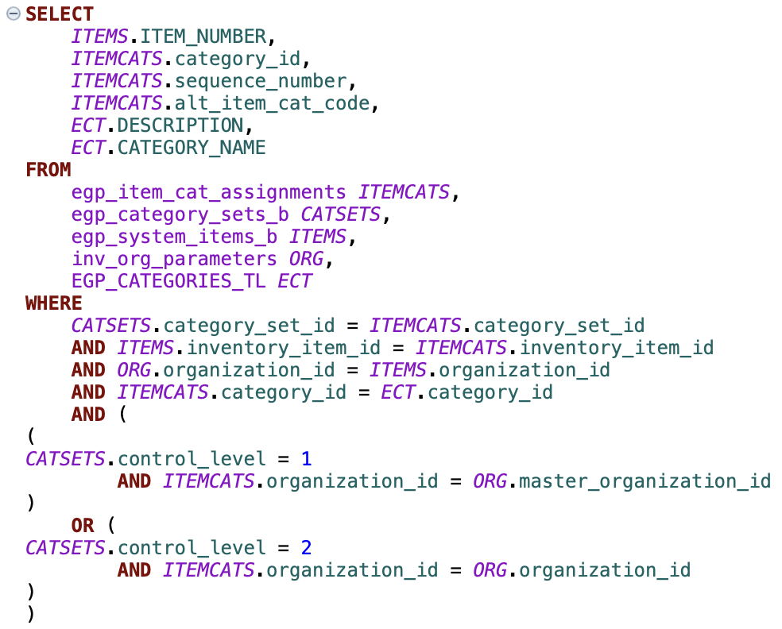

# JDBC Driver and SQL Query Tool for Oracle Fusion

A lightweight, read‑only JDBC driver that translates SQL queries into SOAP requests for Oracle Fusion. Works seamlessly with DBeaver, IntelliJ, and other JDBC-compliant tools, giving you full SQL capabilities over your Fusion data.

> 🔔 **New!** Check out the - [Agentic SQL & RAG engine for Oracle Fusion. Features local schema caching, semantic search, and real-time SQL execution for AI agents](https://github.com/krokozyab/ofrag).

---

## 🚀 Quick Start

1.  **Download:** Get the latest `orfujdbc-x.x.jar` from [Releases](https://github.com/krokozyab/ofjdbc/releases).
2.  **Prepare Fusion:** Upload `otbireport/DM_ARB.xdm.catalog` and `RP_ARB.xdo.catalog` to `/Shared Folders/Custom/Financials` in your Fusion instance.
3.  **Connect:** Add the JAR to your IDE and connect:
    *   **URL:** `jdbc:wsdl://<host>/xmlpserver/services/ExternalReportWSSService?WSDL:/Custom/Financials/RP_ARB.xdo`
    *   **Class:** `my.jdbc.wsdl_driver.WsdlDriver`
    *   **Auth:** Fusion Username & Password **OR** Browser SSO (add `?authType=BROWSER` to URL)

[👉 **Read the Full Setup Guide with Screenshots**](docs/setup_guide.md)
[🔐 **SSO Browser Authentication Setup**](docs/sso_authentication.md)

## ✨ Key Features

*   **Native SQL Support:** Query tables like `GL_JE_HEADERS` directly using standard SQL.
*   **SSO Authentication:** Browser-based Single Sign-On with MFA support (add `?authType=BROWSER` to URL). [Setup Guide →](docs/sso_authentication.md)
*   **Smart Caching:** Local DuckDB-based metadata cache enables fast auto-completion and syntax highlighting in your IDE.
*   **Pagination:** Automatically handles large datasets by injecting `FETCH FIRST` clauses.
*   **Secure:** Credentials run locally on your machine; no third-party cloud relay.

## ⚠️ Limitations

*   **Read-Only:** Supports `SELECT` queries only. Transaction commands (`COMMIT`, `ROLLBACK`) are ignored.
*   **Performance:** While pagination is automatic, huge exports may be slower than native DB access due to SOAP overhead.
*   **Security:** Ensure this tool complies with your organization's security policies before use.

## 📄 Documentation

*   [Detailed Setup Guide](docs/setup_guide.md)
*   [SSO Browser Authentication](docs/sso_authentication.md) - **New!** Configure Single Sign-On with MFA support
*   [Secured Views Mappings](docs/hr_secured_views.md)
*   [Environment Variables](docs/environment-variables.md)

## 📫 Contact

Questions? Open a [GitHub Issue](https://github.com/krokozyab/ofjdbc/issues) or contact `email@sergey.rudenko.ba@gmail.com`.
If this project helped you, please consider leaving a ⭐!
