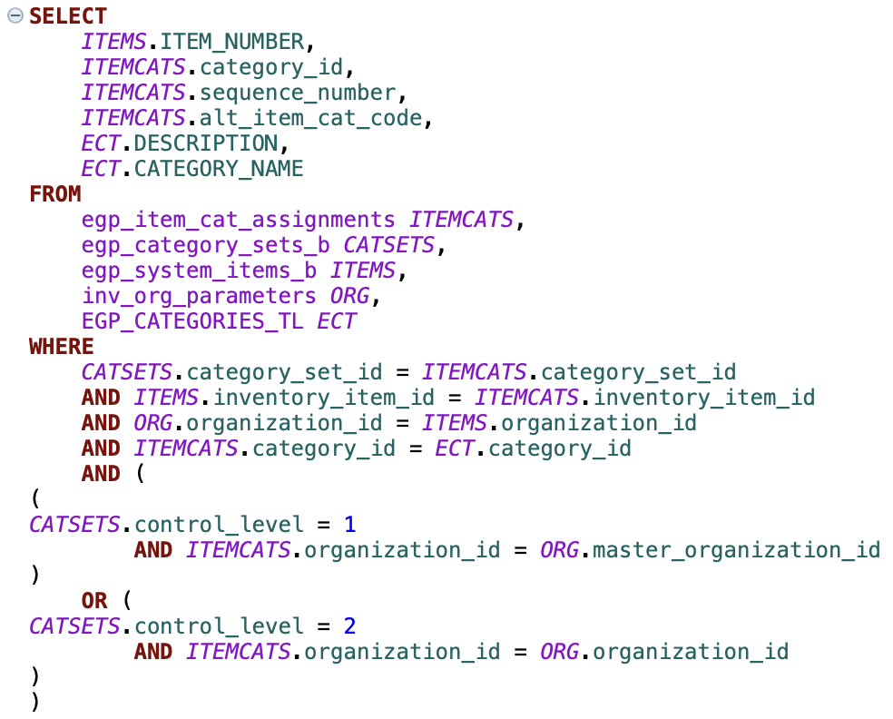

<h1 align="center">OFJDBC — JDBC Driver for Oracle Fusion Cloud</h1>

<p align="center">
  <strong>Run SQL queries directly against Oracle Fusion. Free. Open-source. No OTBI required.</strong>
</p>

<p align="center">
  <a href="https://github.com/krokozyab/ofjdbc/blob/master/LICENSE.md"></a>
  <a href="https://github.com/krokozyab/ofjdbc/stargazers"></a>
  <a href="https://oraclefusionsql.com"></a>
</p>

<p align="center">
  <a href="#-quick-start">Quick Start</a> · 
  <a href="#-why-ofjdbc">Why OFJDBC</a> · 
  <a href="#-comparison-with-alternatives">Comparison</a> · 
  <a href="#-ecosystem">Ecosystem</a> · 
  <a href="#-documentation">Docs</a>
</p>


[](https://github.com/krokozyab/ofjdbc/releases)

## The Problem

Oracle Fusion Cloud doesn't allow direct database connections. Developers and consultants are forced to use **OTBI** (limited subject areas, 65K row cap), **BI Publisher** (tiny SQL editor, multi-step process), or **paid third-party tools** — just to run a simple `SELECT` query.

**OFJDBC fixes this.** It's a lightweight JDBC driver that translates standard SQL into SOAP requests against Oracle Fusion's BI layer. Plug it into DBeaver, IntelliJ, or any JDBC-compatible tool — and query Oracle Fusion tables like a normal database.

## ✨ Why OFJDBC

| | OFJDBC + DBeaver | Proprietary SQL Tools | BI Publisher |
|---|:---:|:---:|:---:|
| **Price** | **Free & Open Source** | Freemium / Paid tiers | Bundled with Fusion |
| **Source Code** | ✅ MIT License | ❌ Proprietary | ❌ Oracle |
| **Platform** | Windows, macOS, Linux | Windows or Web only | Web only |
| **IDE** | DBeaver, IntelliJ, any JDBC tool | Own editor only | Own editor |
| **Multi-Database** | ✅ Same DBeaver window: Fusion + EBS + PostgreSQL + any DB | ❌ Oracle Fusion only | ❌ Oracle Fusion only |
| **Metadata Autocomplete** | ✅ Local DuckDB cache | ✅ Built-in | ❌ |
| **Export Formats** | Parquet, CSV, JSON, Excel, DuckDB, cloud storage | Excel, CSV | Excel, PDF, HTML |
| **ETL / Pipeline Support** | ✅ Airflow, NiFi, Talend, any JVM | ❌ | Limited (ESS) |
| **Cloud Data Lake Integration** | ✅ S3, GCS, Azure Blob, OCI | ❌ | ❌ |
| **BI Tool Integration** | Any tool with JDBC support: Power BI, Tableau, Looker, QuickSight, etc. | ❌ | Limited |
| **AI / MCP Server** | ✅ [ofrag](https://github.com/krokozyab/ofrag) — Claude, OpenAI, Gemini | ❌ | ❌ |
| **Programmatic Access (JVM)** | ✅ Java, Kotlin, Scala, Groovy | ❌ | REST API |

> **Bottom line:** Proprietary tools give you a query window that works with Oracle Fusion and nothing else. OFJDBC is a **standard JDBC driver** — it turns Oracle Fusion into just another data source in your existing IDE, alongside Oracle EBS, PostgreSQL, MySQL, or any other database. One tool for everything.

## 🚀 Quick Start

### 1. Download the JAR
Get the latest `orfujdbc-x.x.jar` from [Releases](https://github.com/krokozyab/ofjdbc/releases).

### 2. Upload BI Publisher Catalogs
Upload `otbireport/DM_ARB.xdm.catalog` and `RP_ARB.xdo.catalog` to  
`/Shared Folders/Custom/Financials` in your Oracle Fusion instance.

### 3. Connect

| Setting | Value |
|---|---|
| **JDBC URL** | `jdbc:wsdl://<host>/xmlpserver/services/ExternalReportWSSService?WSDL:/Custom/Financials/RP_ARB.xdo` |
| **Driver Class** | `my.jdbc.wsdl_driver.WsdlDriver` |
| **Authentication** | Fusion Username & Password **or** Browser SSO (`?authType=BROWSER`) |

### 4. Query
<p align="center">
  
</p>


👉 [**Full Setup Guide with Screenshots**](docs/setup_guide.md)  
🔐 [**SSO Browser Authentication**](docs/sso_authentication.md)

## 🔧 Key Features

**Standard JDBC Driver** — Not a standalone app, but a real JDBC driver. Use it anywhere JDBC works: DBeaver, IntelliJ DataGrip, Apache Airflow, custom Java/Kotlin apps, ETL platforms.

**Smart Metadata Cache** — Local DuckDB-based cache of Oracle Fusion metadata. Enables fast autocomplete, syntax highlighting, and table/column discovery in your IDE without querying production.

**SSO & MFA** — Browser-based Single Sign-On with MFA support. Add `?authType=BROWSER` to your JDBC URL and authenticate through your corporate identity provider.

**Automatic Pagination** — Handles large datasets transparently by injecting `FETCH FIRST` clauses. No manual pagination needed.

**Runs Locally** — Your credentials and data never leave your machine. No third-party cloud relay, no SaaS intermediary. Fully auditable open-source code.

## 🌐 Ecosystem

OFJDBC is the foundation of a complete open-source platform for Oracle Fusion data access:

```
┌──────────────────────────────────────────────────────────┐
│                     AI / LLM Layer                       │
│  ofrag — MCP Server for Claude, Gemini, any LLM          │
│  Semantic search · SQL validation · Natural language     │
├──────────────────────────────────────────────────────────┤
│                    Data Access Layer                     │
│  OFJDBC (JDBC)                                           │
│  JVM, DBeaver, Airflow, any JDBC-compatible tool         │
├──────────────────────────────────────────────────────────┤
│                  Oracle Fusion Cloud                     │
│              BI Publisher SOAP Web Services              │
└──────────────────────────────────────────────────────────┘
```

| Project | What it does | Link |
|---|---|---|
| **OFJDBC** | JDBC driver — SQL access from DBeaver, IntelliJ, JVM apps | [GitHub](https://github.com/krokozyab/ofjdbc) |
| **ofrag** | AI RAG engine & MCP Server — natural language queries via Claude/Gemini | [GitHub](https://github.com/krokozyab/ofrag) |

## 💡 Use Cases

**Ad-hoc troubleshooting** — Query `GL_JE_HEADERS`, `AP_INVOICES_ALL`, `AR_PAYMENT_SCHEDULES_ALL` directly without creating OTBI reports or BI Publisher data models.

**Data warehouse exports** — Build automated ETL pipelines with Airflow or NiFi. Export to Parquet, load into S3/BigQuery/Snowflake.

**Cloud data lakes** — Oracle Fusion → OFJDBC → DBeaver export → AWS S3 → Athena → QuickSight. Full pipeline, zero license cost.

**AI-powered analysis** — Combine with [ofrag](https://github.com/krokozyab/ofrag) to let AI agents query Oracle Fusion in natural language. The AI discovers tables semantically, validates SQL locally, and executes against Fusion.

**EBS → Fusion migration** — Migrating from Oracle EBS to Fusion Cloud? In DBeaver, open EBS (native Oracle JDBC) and Fusion (OFJDBC) side by side in the same workspace. Compare data, validate mappings, reconcile record counts — all without switching tools. This works with any database: PostgreSQL staging, MySQL, SQL Server — anything with a JDBC driver lives in one IDE.

**Cross-environment comparison** — Connect to DEV, SIT, UAT, PROD from the same DBeaver workspace. Compare data across environments side by side.

**Integration development** — Use programmatically in Kotlin/Java to validate data during OIC integration development, reconcile source-to-target, or generate test datasets.

## ⚠️ Limitations

- **Read-only** — `SELECT` queries only. `INSERT`/`UPDATE`/`DELETE`/`COMMIT`/`ROLLBACK` are not supported (Oracle Fusion does not permit write access through the BI layer).
- **Performance** — SOAP transport adds overhead compared to native DB access. Automatic pagination helps, but very large exports may take time. For bulk extracts, consider BICC.
- **Security** — Ensure usage complies with your organization's security policies and Oracle Fusion terms of service.

## 📄 Documentation

| Guide | Description |
|---|---|
| [Setup Guide](docs/setup_guide.md) | Step-by-step installation with DBeaver screenshots |
| [SSO Authentication](docs/sso_authentication.md) | Browser-based SSO with MFA support |
| [Secured Views Mappings](docs/hr_secured_views.md) | HCM secured view reference |
| [Environment Variables](docs/environment-variables.md) | Configuration options |
| [Programmatic Examples](programmatically_examples/) | Java/Kotlin code samples |

## 📚 Articles & Tutorials

- [Analysis of Ad-Hoc SQL Query Tools for Oracle Fusion Cloud](https://www.linkedin.com/pulse/analysis-ad-hoc-sql-query-tools-oracle-fusion-cloud-sergey-rudenko-igaif/) — Detailed comparison of available tools
- [Building Oracle Fusion → AWS S3 → Athena → QuickSight Pipelines](https://www.linkedin.com/pulse/bridging-gap-using-open-source-jdbc-driver-oracle-fusion-rudenko-i6cwf/) — End-to-end data lake tutorial
- [Query Oracle Fusion & Visualize in Apache Superset](https://www.linkedin.com/pulse/query-oracle-fusion-arrow-flight-sql-visualize-apache-sergey-rudenko-7rwlf/)
- [Export Oracle Fusion Data to Google Sheets in Minutes](https://www.linkedin.com/pulse/export-oracle-fusion-data-google-sheets-minutes-sergey-rudenko-izj4f/)
- [Replace OIC Batch ETL — ofload Reference Implementation](https://github.com/krokozyab/ofload) — Production Oracle Fusion → Autonomous Database ETL service: REST-triggered, incremental pagination, MERGE       
  idempotency, Prometheus metrics

## 🤝 Contributing

Contributions are welcome! Open a [GitHub Issue](https://github.com/krokozyab/ofjdbc/issues) for bugs or feature requests, or submit a pull request. Join the [Discussions](https://github.com/krokozyab/ofjdbc/discussions) for questions and ideas.

## 📫 Contact

- **Website:** [oraclefusionsql.com](https://oraclefusionsql.com)
- **GitHub Issues:** [krokozyab/ofjdbc/issues](https://github.com/krokozyab/ofjdbc/issues)
- **Email:** sergey.rudenko.ba@gmail.com
- **LinkedIn:** [Sergey Rudenko](https://www.linkedin.com/in/sergey-rudenko-ba/)

---

<p align="center">
  If this project saved you time or money, consider leaving a ⭐
  <br><br>
  <strong>Free and open-source.</strong> Built by an Oracle Fusion consultant, for Oracle Fusion consultants.
</p>
