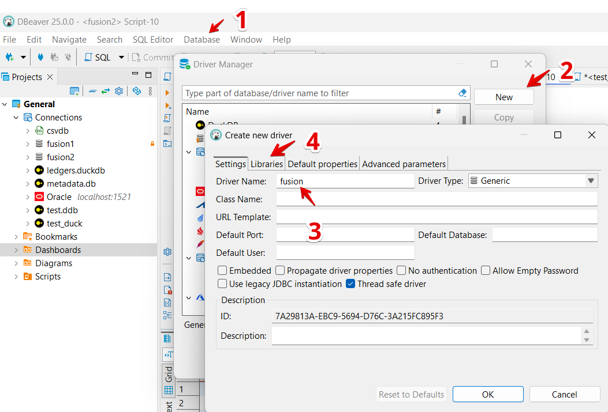
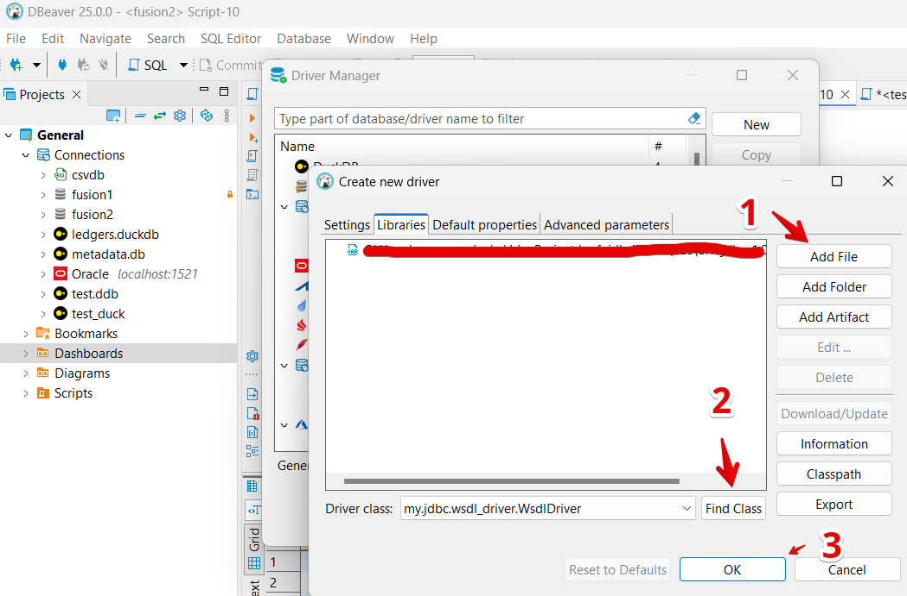
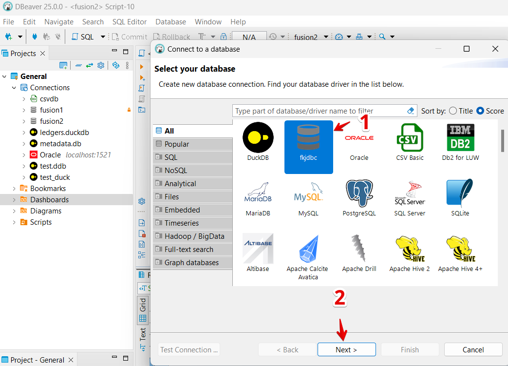
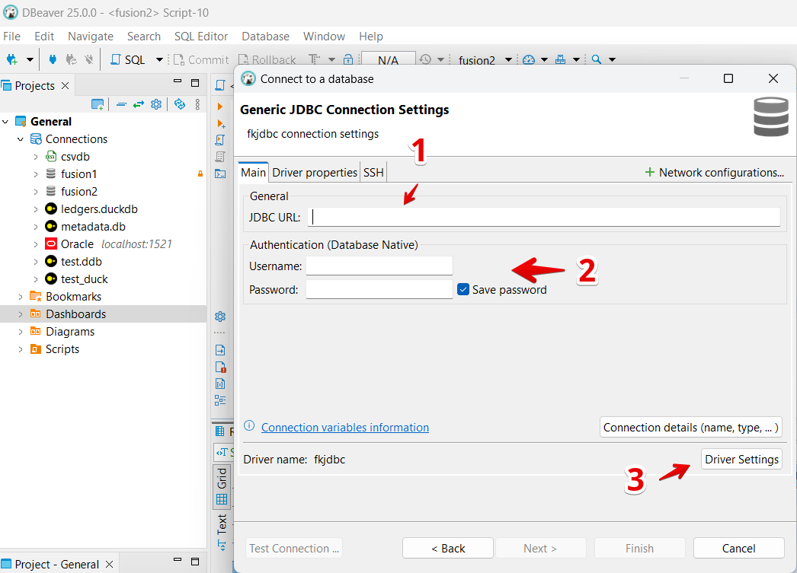
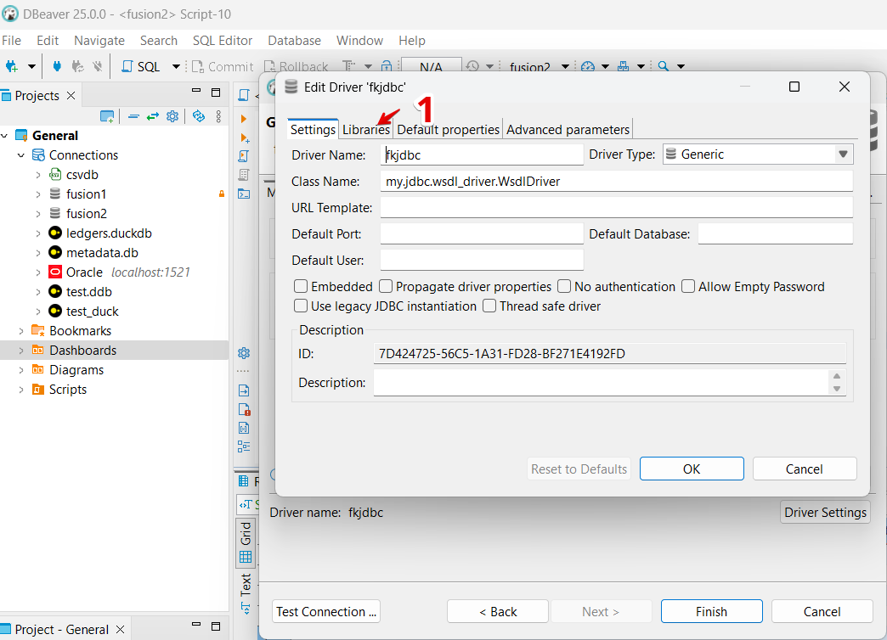
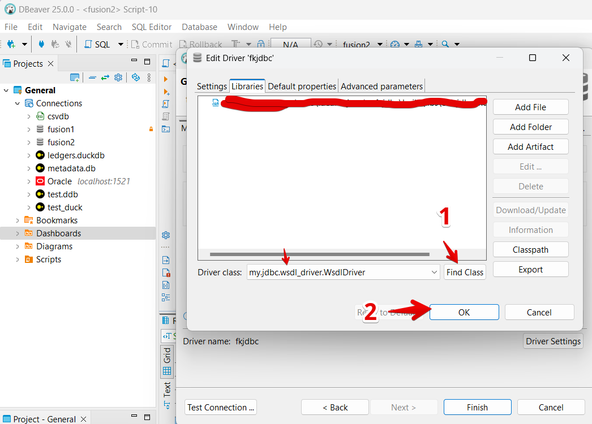
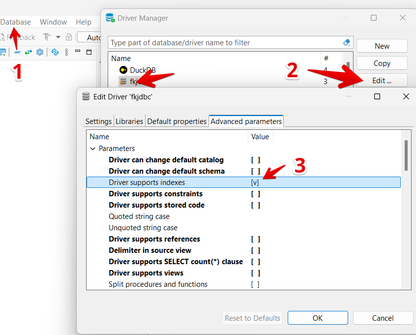

# Setup & Configuration Guide

This guide provides detailed instructions for setting up the OFJDBC driver in your SQL client.

## 🛠 Prerequisites

- **Oracle Fusion Access:** Valid credentials with access to Oracle Fusion reporting (via WSDL).
- **JDK/JRE:** A Java 8 (or later) runtime installed on your machine.
- **IDE:** A JDBC-compliant tool like DBeaver, DbVisualizer, or IntelliJ IDEA.

## 📝 Installation

1.  **Download the Driver:**
    Download the latest version (`orfujdbc-1.0-SNAPSHOT.zip`) from the [Releases page](https://github.com/krokozyab/ofjdbc/releases).

2.  **Setup Fusion Reports:**
    In your Fusion instance, un-archive `DM_ARB.xdm.catalog` and `RP_ARB.xdo.catalog` (found in the `otbireport` folder of this repository) into the `/Shared Folders/Custom/Financials` folder.
    *Note: You can use a different folder path, but you will need to update the report path in the connection URL.*

## ⚙️ Configuration (Step-by-Step)

1.  **Place the Driver File:** Save the downloaded JAR file to a permanent location on your computer.
2.  **Register the Driver:** Open your IDE (DBeaver, DBVisualizer, IntelliJ) and open the Driver Manager to register a new driver.
3.  **Driver Settings:**
    *   **Class Name:** `my.jdbc.wsdl_driver.WsdlDriver`
    *   **Library:** Select the JAR file you saved.

    
    

4.  **Create Connection:** Create a new database connection using the driver you just registered.

    

5.  **Connection Details:**
    *   **JDBC URL:** `jdbc:wsdl://<your-server>.oraclecloud.com/xmlpserver/services/ExternalReportWSSService?WSDL:/Custom/Financials/RP_ARB.xdo`
    *   **Username/Password:** Your Oracle Fusion credentials.

    
    
    

6.  **Windows Users:** Enable view indexes in driver settings if required.

    

## 💡 Tips for DBeaver Users

1.  **Avoid Root Refresh:** Don’t right-click → Refresh on the “Indexes” folder of your connection root. This triggers a massive schema-wide metadata scan.
2.  **Expand Individually:** Expand the connection, then the **Tables** node, find your target table, and **only then** expand its **Indexes** subnode.
3.  **Scripting:** If you need a full index list, query `ALL_INDEXES` or `ALL_IND_COLUMNS` via SQL instead of using the UI tree.

## 🔄 Cache Management

The driver uses a local DuckDB database to cache metadata.
*   **Location:** `~/.ofjdbc/metadata.db`
*   **Invalidation:** If you update the driver or schema changes significantly, delete `metadata.db` and `metadata.db.wal` from your user folder to force a refresh.
