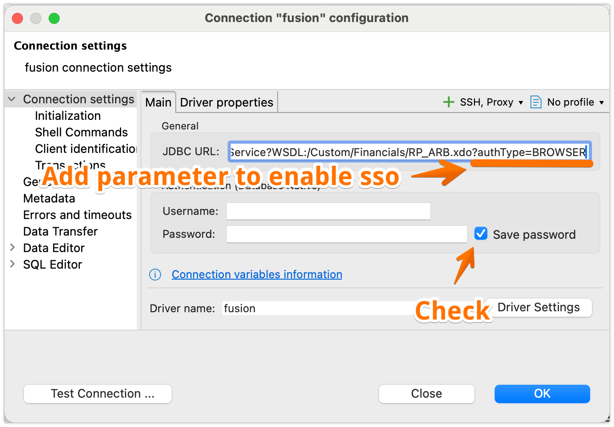

# SSO Browser Authentication Setup

## Overview

Oracle Fusion JDBC Driver supports browser-based Single Sign-On (SSO) authentication, allowing you to authenticate using your organization's identity provider instead of entering username and password directly.

**Benefits**:
- ✅ Supports Multi-Factor Authentication (MFA)
- ✅ Uses your organization's SSO provider (SAML, OAuth, etc.)
- ✅ Session persistence - cookies saved between connections
- ✅ No need to store passwords in DBeaver/IDE

---

## Quick Setup

### Step 1: Add Authentication Parameter

Add `?authType=BROWSER` to your JDBC URL:

**Before (Basic Authentication)**:
```
jdbc:wsdl://your-instance.oraclecloud.com/xmlpserver/services/ExternalReportWSSService?WSDL:/Custom/Financials/RP_ARB.xdo
```

**After (SSO Browser Authentication)**:
```
jdbc:wsdl://your-instance.oraclecloud.com/xmlpserver/services/ExternalReportWSSService?WSDL:/Custom/Financials/RP_ARB.xdo?authType=BROWSER
```

### Step 2: Configure in DBeaver

1. Open your connection settings
2. Navigate to **Main** tab
3. Add `?authType=BROWSER` to the **JDBC URL** field
4. **Leave Username and Password fields empty** (they're not needed for SSO)
5. **Check "Save password"** checkbox (saves session cookies)
6. Click **Driver Settings** to verify driver is loaded
7. Click **OK**



### Step 3: Restart DBeaver (Recommended)

After changing authentication type:
```
1. Save connection settings
2. Restart DBeaver
3. Connect to test SSO authentication
```

**Why restart?** Ensures clean connection pool and prevents cached authentication conflicts.

---

## How It Works

1. **Connect**: Click "Connect" in DBeaver
2. **Browser Opens**: Chrome/Chromium launches automatically
3. **SSO Login**: Complete authentication in browser (MFA, SSO provider, etc.)
4. **Token Extracted**: Driver extracts JWT token from browser
5. **Browser Closes**: Browser closes automatically after successful login
6. **Connection Ready**: DBeaver connected and ready to query

**Session Persistence**: Your authentication cookies are saved in `~/.ofjdbc/chrome-profile/`, so subsequent connections may not require re-authentication (depends on token expiration).

---

## Authentication Types Comparison

| Feature | Basic Auth | Browser SSO |
|---------|------------|-------------|
| **Username/Password** | Required | Not needed |
| **MFA Support** | ❌ No | ✅ Yes |
| **SSO Provider** | ❌ No | ✅ Yes (SAML, OAuth) |
| **Password Storage** | In DBeaver | Not needed |
| **Session Persistence** | No | ✅ Yes (cookies) |
| **Browser Required** | No | ✅ Yes (Chrome/Chromium) |
| **Setup Complexity** | Simple | Moderate |

---

## Requirements

### Chrome/Chromium Browser

Browser-based authentication requires Chrome or Chromium installed on your system.

**Automatic Detection**:
- macOS: `/Applications/Google Chrome.app/Contents/MacOS/Google Chrome`
- Windows: `%LOCALAPPDATA%\Google\Chrome\Application\chrome.exe`
- Linux: `/usr/bin/google-chrome`, `/usr/bin/chromium`

**Custom Chrome Path** (if not auto-detected):
```bash
export OFJDBC_CHROME_PATH="/path/to/chrome"
```

### Network Access

Browser must be able to access:
- Your Oracle Fusion instance (e.g., `https://your-instance.oraclecloud.com`)
- Your organization's SSO provider (if using federated authentication)

---

## Configuration Options

### Basic Configuration

```bash
# JDBC URL with SSO enabled
jdbc:wsdl://your-instance.oraclecloud.com/...?authType=BROWSER
```

### Advanced Configuration

#### Custom SSO Login URL

If your organization uses a custom login URL:

```bash
export OFJDBC_SSO_LOGIN_URL="https://custom-login.yourcompany.com"
```

Or in Java/Kotlin:
```java
System.setProperty("ofjdbc.ssoLoginUrl", "https://custom-login.yourcompany.com");
```

#### Temporary Chrome Profile (Non-Persistent Cookies)

By default, cookies are saved for session persistence. To disable:

```bash
export OFJDBC_USE_TEMP_PROFILE=true
```

**When to use**: Testing, shared computers, or security policies requiring no session persistence.

#### Authentication Timeout

Default timeout is 300 seconds (5 minutes). To change:

```bash
export OFJDBC_SSO_TIMEOUT_SECONDS=600  # 10 minutes
```

Or in Java:
```java
System.setProperty("ofjdbc.ssoTimeoutSeconds", "600");
```

---

## Troubleshooting

### Browser Doesn't Open

**Symptom**: Connection fails with "Failed to launch Chrome browser"

**Solutions**:
1. **Install Chrome/Chromium**:
   - macOS: `brew install --cask google-chrome`
   - Windows: Download from https://www.google.com/chrome/
   - Linux: `sudo apt-get install google-chrome-stable`

2. **Specify Chrome Path**:
   ```bash
   export OFJDBC_CHROME_PATH="/usr/bin/chromium-browser"
   ```

3. **Check Permissions**: Ensure Chrome executable has execute permissions

### Browser Opens But Connection Fails

**Symptom**: Browser opens, you log in, but DBeaver shows "Connection failed"

**Solutions**:

1. **Check Timeout**: Increase timeout if SSO login takes longer:
   ```bash
   export OFJDBC_SSO_TIMEOUT_SECONDS=600
   ```

2. **Verify Token Extraction**: Check logs for:
   ```
   INFO - Successfully extracted token from localStorage
   ```

3. **Restart DBeaver**: Close DBeaver completely and restart

4. **Clear Chrome Profile**:
   ```bash
   rm -rf ~/.ofjdbc/chrome-profile/
   ```

### "Connection cannot be established" After Login

**Symptom**: Browser shows successful login, but DBeaver still shows connection error

**Solutions**:

1. **Restart DBeaver** (most common fix)
2. **Remove `?authType=BROWSER` temporarily** to test basic auth:
   - If basic auth works → SSO configuration issue
   - If basic auth fails → Oracle Fusion connectivity issue

3. **Check Logs**:
   ```bash
   tail -f ~/.dbeaver/workspace6/log/dbeaver-debug.log
   ```

### Multiple Chrome Windows Open

**Symptom**: Each connection attempt opens a new Chrome window

**Solution**: Old Chrome processes not closing properly.

1. **Kill Chrome processes**:
   ```bash
   # macOS/Linux
   pkill -f "remote-debugging-port"

   # Windows
   taskkill /F /IM chrome.exe
   ```

2. **Restart DBeaver**

### Session Expires Too Quickly

**Symptom**: Need to re-authenticate on every connection

**Solutions**:

1. **Check Cookie Persistence**:
   ```bash
   # Should NOT be set to true
   unset OFJDBC_USE_TEMP_PROFILE
   ```

2. **Verify Profile Directory**:
   ```bash
   ls -la ~/.ofjdbc/chrome-profile/
   # Should contain cookies and session data
   ```

3. **Oracle Fusion Token Expiry**: Contact your administrator to extend token lifetime

---

## Security Considerations

### Local Chrome Profile

**Location**: `~/.ofjdbc/chrome-profile/`

**Contains**:
- Authentication cookies
- Session tokens
- Browser cache

**Security**:
- ✅ Stored locally on your machine (not uploaded anywhere)
- ✅ Protected by OS file permissions
- ⚠️ Should be excluded from backups (contains sensitive tokens)

**To remove**:
```bash
rm -rf ~/.ofjdbc/chrome-profile/
```

### Network Security

**SSO Authentication Flow**:
1. Driver launches local Chrome browser
2. Browser connects to Oracle Fusion SSO (HTTPS)
3. You authenticate via your organization's identity provider
4. Browser receives JWT token from Oracle Fusion
5. Driver extracts token from browser local storage
6. Browser closes
7. Driver uses token for JDBC authentication

**Security Notes**:
- ✅ All communication over HTTPS
- ✅ Token extracted via Chrome DevTools Protocol (local)
- ✅ No credentials sent to third parties
- ✅ Driver runs entirely on your machine

### Compliance

**Check with your organization**:
- Does your security policy allow automated browser automation?
- Are there restrictions on saving authentication tokens locally?
- Do you need approval to use SSO with third-party tools?

---

## Examples

### DBeaver Configuration

**Connection Settings**:
```
JDBC URL: jdbc:wsdl://fa-xyz.oraclecloud.com/xmlpserver/services/ExternalReportWSSService?WSDL:/Custom/Financials/RP_ARB.xdo?authType=BROWSER
Username: (leave empty)
Password: (leave empty)
☑ Save password (enables session persistence)
```

**Driver Settings**:
- Driver name: fusion
- Class name: my.jdbc.wsdl_driver.WsdlDriver
- JAR file: orfujdbc-1.0-SNAPSHOT.jar

### IntelliJ IDEA

**Data Source Configuration**:
```
Type: Generic
Driver: Oracle Fusion JDBC (custom)
URL: jdbc:wsdl://fa-xyz.oraclecloud.com/...?authType=BROWSER
User: (leave empty)
Password: (leave empty)
```

### Java Code

```java
import java.sql.*;

public class FusionSsoExample {
    public static void main(String[] args) throws SQLException {
        // Set custom SSO timeout (optional)
        System.setProperty("ofjdbc.ssoTimeoutSeconds", "600");

        String url = "jdbc:wsdl://fa-xyz.oraclecloud.com/xmlpserver/services/ExternalReportWSSService?WSDL:/Custom/Financials/RP_ARB.xdo?authType=BROWSER";

        // No username/password needed for SSO
        Connection conn = DriverManager.getConnection(url);

        // Browser will open automatically for authentication
        // After successful login, connection is ready

        Statement stmt = conn.createStatement();
        ResultSet rs = stmt.executeQuery("SELECT * FROM GL_JE_HEADERS WHERE ROWNUM <= 10");

        while (rs.next()) {
            System.out.println(rs.getString("JE_HEADER_ID"));
        }

        conn.close();
    }
}
```

---

## Environment Variables Reference

| Variable | Type | Default | Description |
|----------|------|---------|-------------|
| `OFJDBC_CHROME_PATH` | String | Auto-detect | Custom path to Chrome/Chromium executable |
| `OFJDBC_SSO_LOGIN_URL` | String | `https://<host>` | Custom SSO login URL |
| `OFJDBC_SSO_TIMEOUT_SECONDS` | Integer | `300` | Authentication timeout in seconds |
| `OFJDBC_USE_TEMP_PROFILE` | Boolean | `false` | Use temporary Chrome profile (no session persistence) |

---

## FAQ

### Q: Do I need to install Chrome if I already have Edge/Firefox?

**A**: Yes, currently only Chrome and Chromium are supported for SSO authentication due to Chrome DevTools Protocol requirements.

### Q: Can I use SSO and Basic auth on the same machine?

**A**: Yes! Use different connections:
- Connection 1: `...?authType=BROWSER` (SSO)
- Connection 2: `...` (Basic auth with username/password)

### Q: How long do SSO sessions last?

**A**: Session duration depends on your Oracle Fusion token expiration policy (typically 8-24 hours). Check with your Fusion administrator.

### Q: Does SSO work with VPN/Proxy?

**A**: Yes, as long as Chrome can access your Oracle Fusion instance through the VPN/proxy. The driver uses your system's network configuration.

### Q: Can multiple users share the same Chrome profile?

**A**: No, each user should have their own profile. The profile is stored per-user in `~/.ofjdbc/chrome-profile/`.

### Q: Is my password stored anywhere?

**A**: No! With SSO authentication, you never provide a password to the JDBC driver. You authenticate directly with your organization's identity provider in the browser.

---

## See Also

- [Main Setup Guide](setup_guide.md) - General JDBC driver setup
- [Environment Variables](environment-variables.md) - Complete configuration reference
- [Oracle Fusion Documentation](https://docs.oracle.com/en/cloud/saas/applications-common/) - Official Oracle docs

---

**Need Help?**

- Open an issue: https://github.com/krokozyab/ofjdbc/issues
- Email: sergey.rudenko.ba@gmail.com

---

**Last Updated**: 2025-12-06
